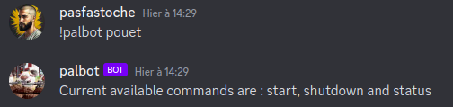

# PalBot
Discord Bot written in golang that can shutdown and start LXC proxmox container

### Purpose
The objective of this bot is to turn off and on the palword server which runs on a Proxmox server under an LXC container.

### Concept
We configure 2 LXC containers such as : 
- VMID 102 palworld-server (based from ubuntu-23.10 and use official setup documentation)
- VMID 103 palbot (based from ubuntu-23.10 and follow next configuration)

The VMID 103 will recieve commands from discord chat, and translate it as API call to Proxmox VE server to shutdown VMID 102.
Currently, we support 3 subcommands : start, shutdown and status.


As an example, you can find the palword-server.service used in /res folder. You will ne to copy it in /etc/systemd/system folder and `systemctl enable palworld-server` to start the palworld server at boot on VMID 102.

### Quickstart
#### Download source
On VMID 103
```sh
git clone git@github.com:NicoFgrx/palbot.git
cd palbot 
env GOOS=linux GOARCH=amd64 go build -o bin/palbot-amd64
```

#### Configure your environment
On VMID 103
Create your .env file with your configuration : 

```yaml
# On-premised proxmox server
PROXMOX_VE_ENDPOINT="https://your_ip:8006/api2/json"
PROXMOX_VE_API_TOKEN_ID="xxx@pve!id"
PROXMOX_VE_API_TOKEN_SECRET="xxx"

# Palword location
PROXMOX_NODE="pve"
PROXMOX_LXC_VMID="100" // your VMID with palword server enable at boot

# Bot configuration
DISCORD_CHANNEL="xxx"
DISCORD_TOKEN="xxxxx"
```


#### Start the bot 
On VMID 103
```bash
./bin/palbot-amd64 & 
```

### Usage



